# System Architecture

> **Note**: This document is part of the Real Estate Platform's technical documentation suite. For related guides, see:
> - [Security Guide](./SECURITY.md) - Security measures and best practices
> - [Development Guide](./development-guide.md) - Development environment setup and workflows
> - [Authentication Setup](./authentication-setup.md) - Detailed authentication implementation
> - [Component Testing Guide](./component-test-guide.md) - Testing procedures and guidelines

## Overview

The Real Estate Platform follows a modular monolithic architecture with the following key components:

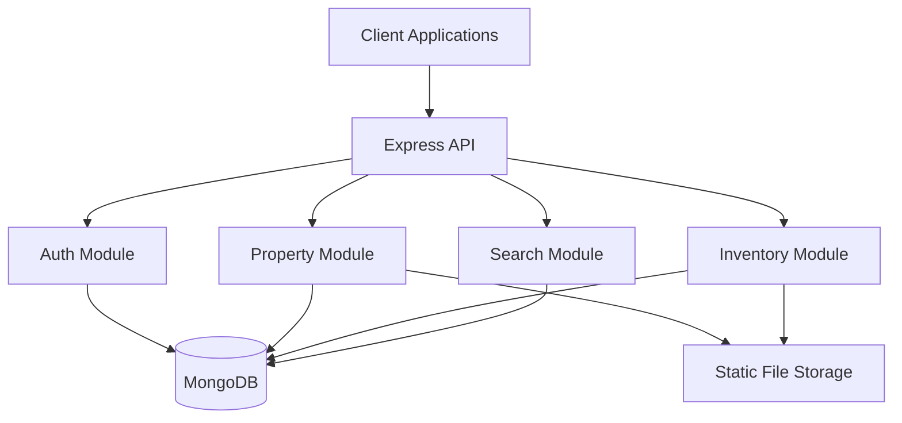
```mermaid
graph TB
    Client[Client Applications]
    API[Express API]
    Auth[Auth Module]
    Prop[Property Module]
    Inventory[Inventory Module]
    Search[Search Module]
    DB[(MongoDB)]
    Static[Static File Storage]

    Client --> API
    API --> Auth
    API --> Prop
    API --> Inventory
    API --> Search
    Auth --> DB
    Prop --> DB
    Inventory --> DB
    Search --> DB
    Prop --> Static
    Inventory --> Static
```

This modular monolithic approach allows for simpler deployment while maintaining separation of concerns through well-defined modules.

## Component Architecture

### Authentication Flow

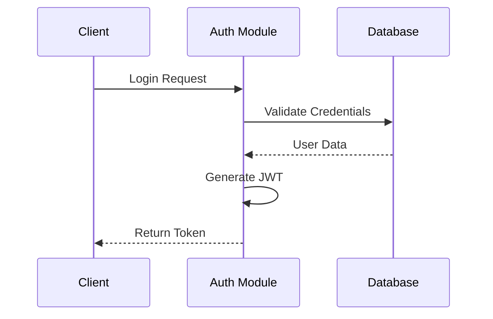
```mermaid
sequenceDiagram
    participant C as Client
    participant A as Auth Module
    participant D as Database
    
    C->>A: Login Request
    A->>D: Validate Credentials
    D-->>A: User Data
    A->>A: Generate JWT
    A-->>C: Return Token
```

### Property Creation Flow

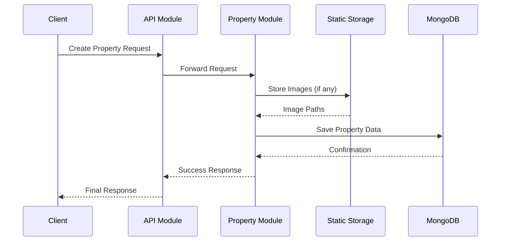
```mermaid
sequenceDiagram
    participant C as Client
    participant API as API Module
    participant P as Property Module
    participant Static as Static Storage
    participant DB as MongoDB

    C->>API: Create Property Request
    API->>P: Forward Request
    P->>Static: Store Images (if any)
    Static-->>P: Image Paths
    P->>DB: Save Property Data
    DB-->>P: Confirmation
    P-->>API: Success Response
    API-->>C: Final Response
```

### Inventory Hierarchical Structure

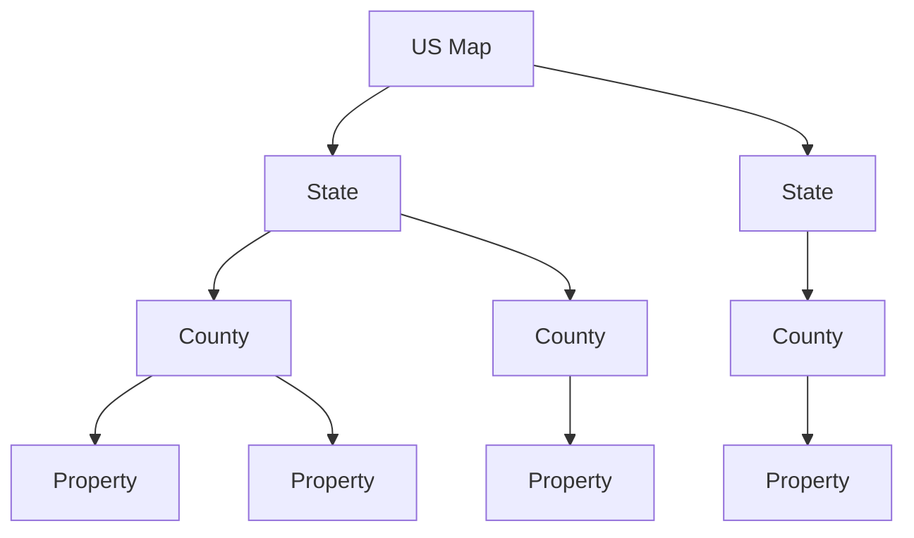
```mermaid
graph TD
    USMap[US Map]
    State1[State]
    State2[State]
    County1[County]
    County2[County]
    County3[County]
    Prop1[Property]
    Prop2[Property]
    Prop3[Property]
    Prop4[Property]
    
    USMap --> State1
    USMap --> State2
    State1 --> County1
    State1 --> County2
    State2 --> County3
    County1 --> Prop1
    County1 --> Prop2
    County2 --> Prop3
    County3 --> Prop4
```

### Search Flow

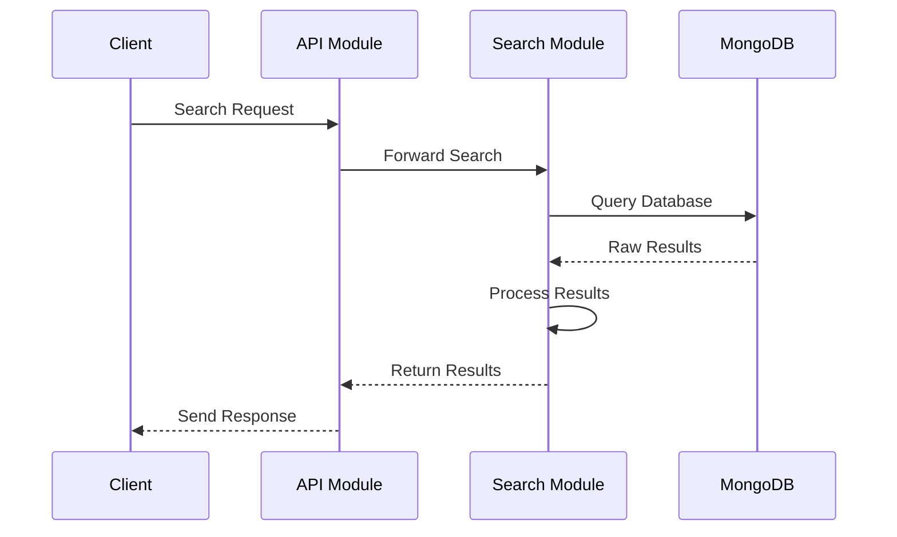
```mermaid
sequenceDiagram
    participant C as Client
    participant API as API Module
    participant S as Search Module
    participant DB as MongoDB

    C->>API: Search Request
    API->>S: Forward Search
    S->>DB: Query Database
    DB-->>S: Raw Results
    S->>S: Process Results
    S-->>API: Return Results
    API-->>C: Send Response
```

## System Components

### API Layer
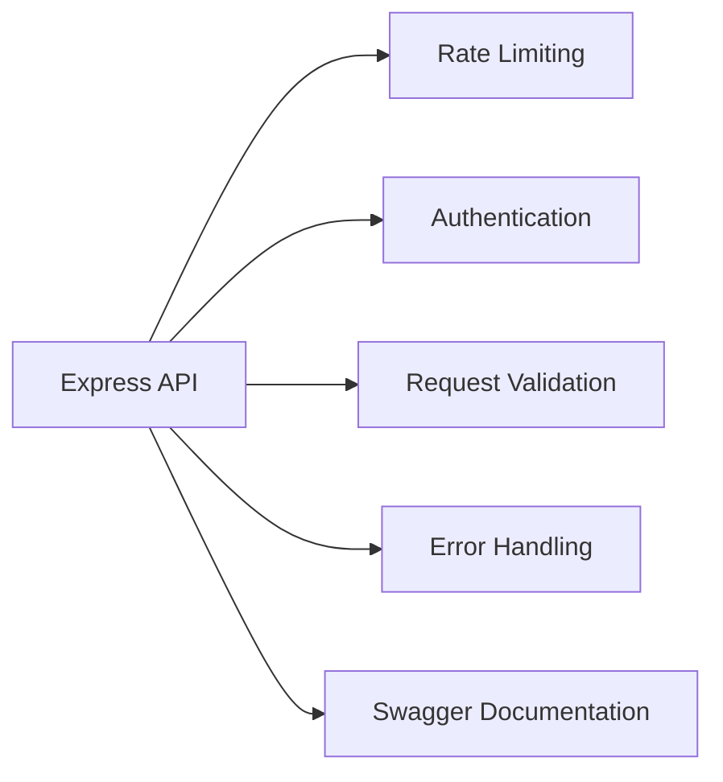
```mermaid
graph LR
    A[Express API] --> B[Rate Limiting]
    A --> C[Authentication]
    A --> D[Request Validation]
    A --> E[Error Handling]
    A --> F[Swagger Documentation]
```

### Property Module
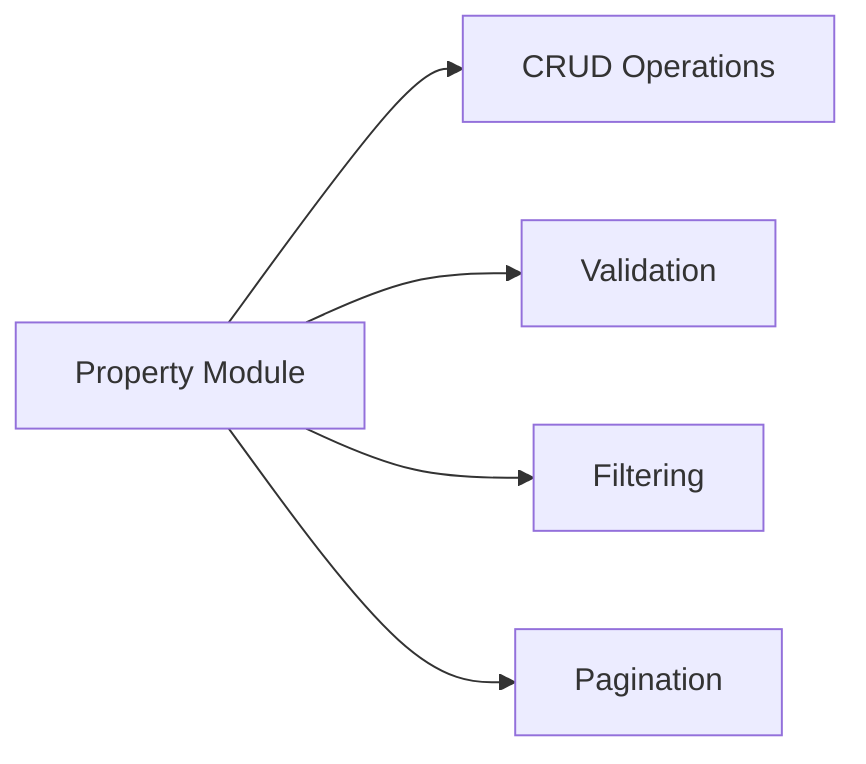
```mermaid
graph LR
    A[Property Module] --> B[CRUD Operations]
    A --> C[Validation]
    A --> D[Filtering]
    A --> E[Pagination]
```

### Inventory Module
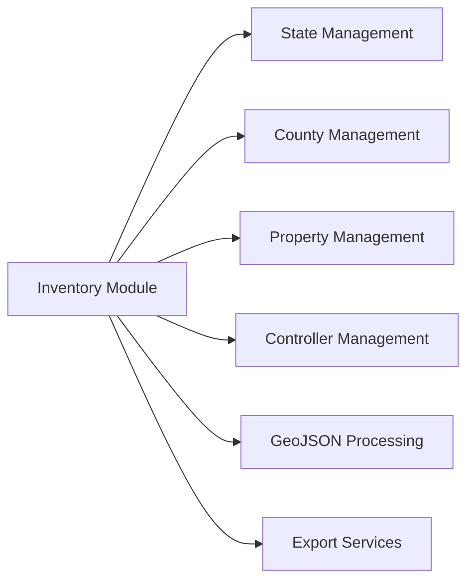
```mermaid
graph LR
    A[Inventory Module] --> B[State Management]
    A --> C[County Management]
    A --> D[Property Management]
    A --> E[Controller Management]
    A --> F[GeoJSON Processing]
    A --> G[Export Services]
```

### Search Module
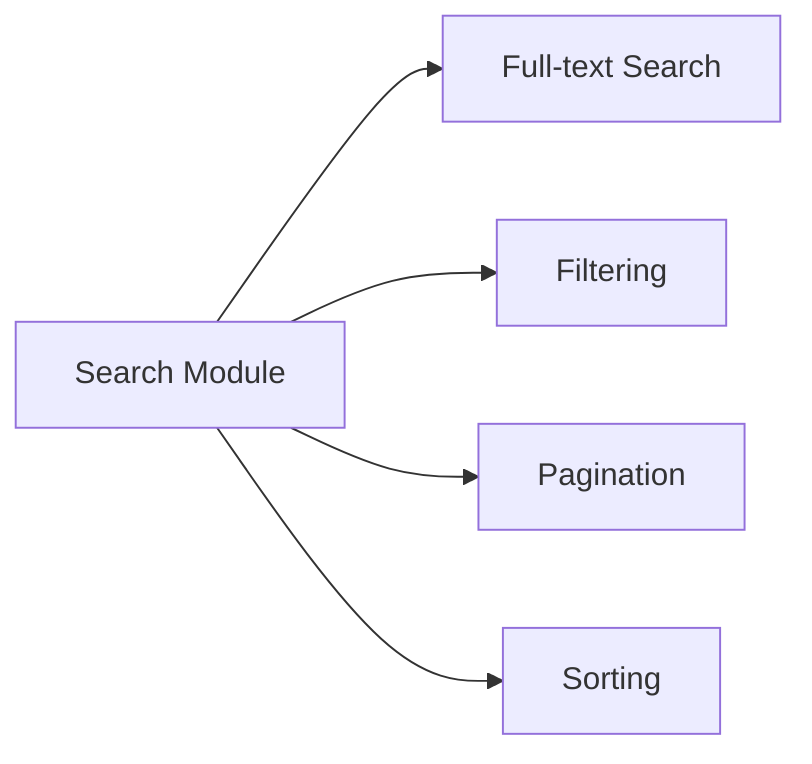
```mermaid
graph LR
    A[Search Module] --> B[Full-text Search]
    A --> C[Filtering]
    A --> D[Pagination]
    A --> E[Sorting]
```

## Data Flow

### User Registration
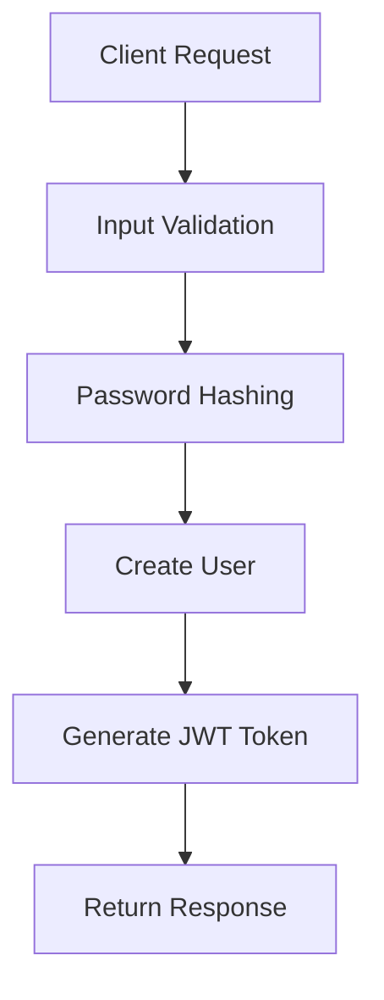
```mermaid
graph TD
    A[Client Request] --> B[Input Validation]
    B --> C[Password Hashing]
    C --> D[Create User]
    D --> E[Generate JWT Token]
    E --> F[Return Response]
```

### Property Listing
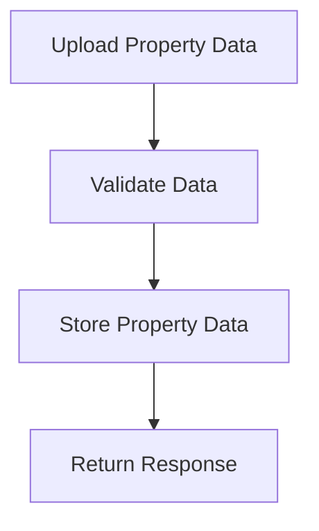
```mermaid
graph TD
    A[Upload Property Data] --> B[Validate Data]
    B --> C[Store Property Data]
    C --> D[Return Response]
```

### State/County/Property Relationship Flow
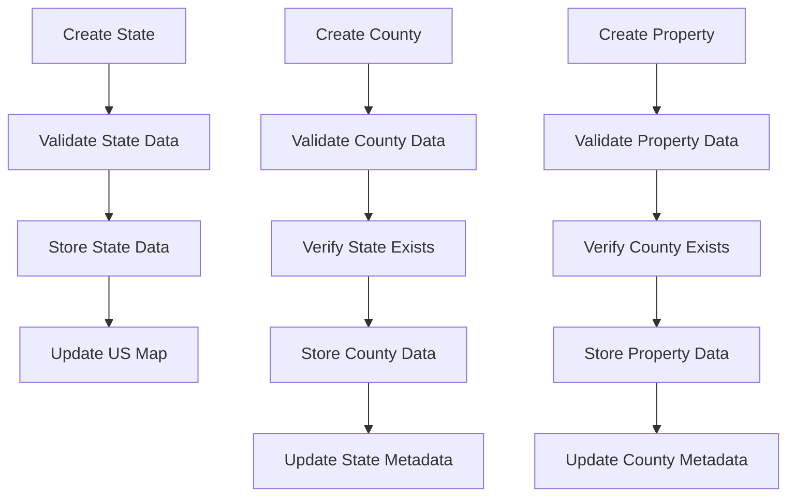
```mermaid
graph TD
    A[Create State] --> B[Validate State Data]
    B --> C[Store State Data]
    C --> D[Update US Map]
    
    E[Create County] --> F[Validate County Data]
    F --> G[Verify State Exists]
    G --> H[Store County Data]
    H --> I[Update State Metadata]
    
    J[Create Property] --> K[Validate Property Data]
    K --> L[Verify County Exists]
    L --> M[Store Property Data]
    M --> N[Update County Metadata]
```

## Infrastructure

### Production Environment
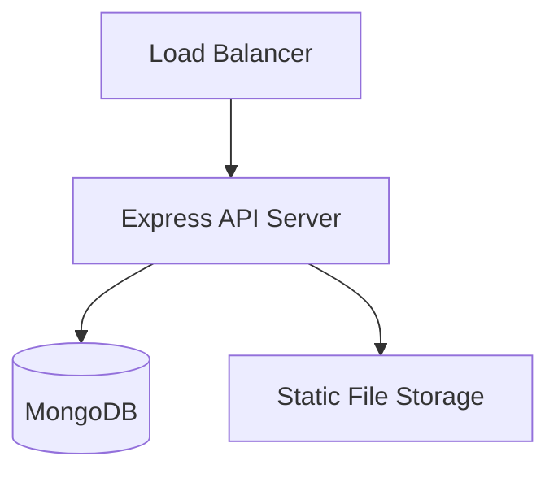
```mermaid
graph TB
    LB[Load Balancer]
    API[Express API Server]
    DB[(MongoDB)]
    Static[Static File Storage]

    LB --> API
    API --> DB
    API --> Static
```

### Monitoring Setup
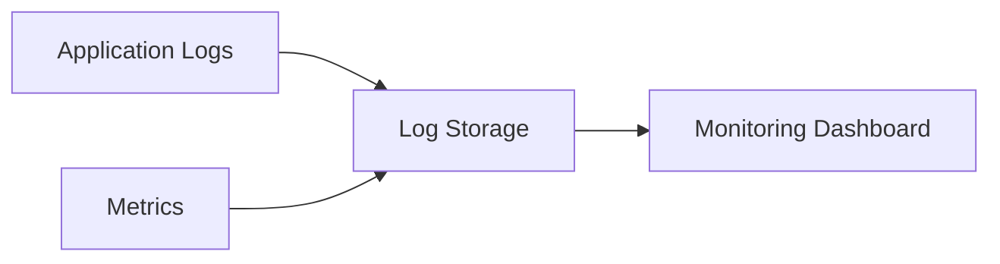
```mermaid
graph LR
    A[Application Logs] --> C[Log Storage]
    M[Metrics] --> C
    C --> G[Monitoring Dashboard]
```

## Security Architecture

### Authentication Flow
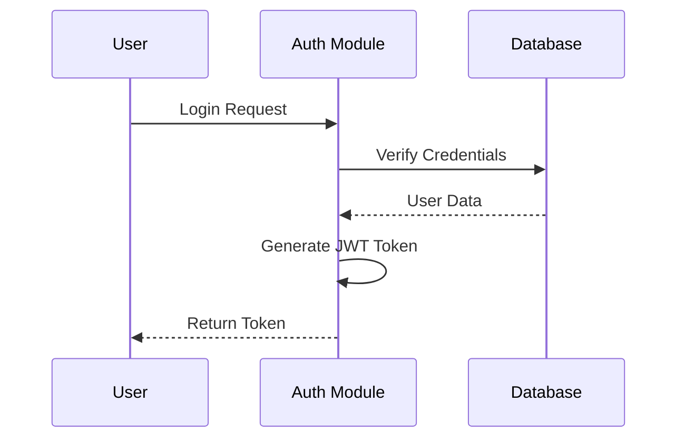
```mermaid
sequenceDiagram
    participant U as User
    participant A as Auth Module
    participant D as Database

    U->>A: Login Request
    A->>D: Verify Credentials
    D-->>A: User Data
    A->>A: Generate JWT Token
    A-->>U: Return Token
```

### Authorization Flow
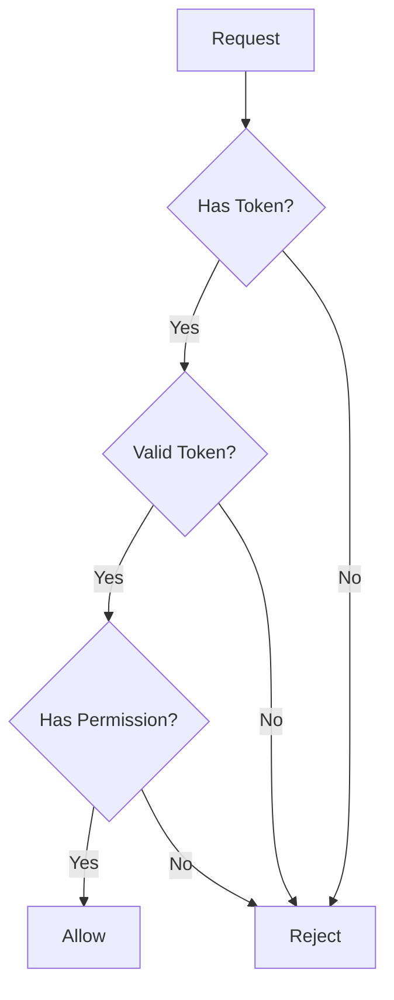
```mermaid
graph TD
    A[Request] --> B{Has Token?}
    B -- Yes --> C{Valid Token?}
    B -- No --> D[Reject]
    C -- Yes --> E{Has Permission?}
    C -- No --> D
    E -- Yes --> F[Allow]
    E -- No --> D
```

### Object-Level Permissions
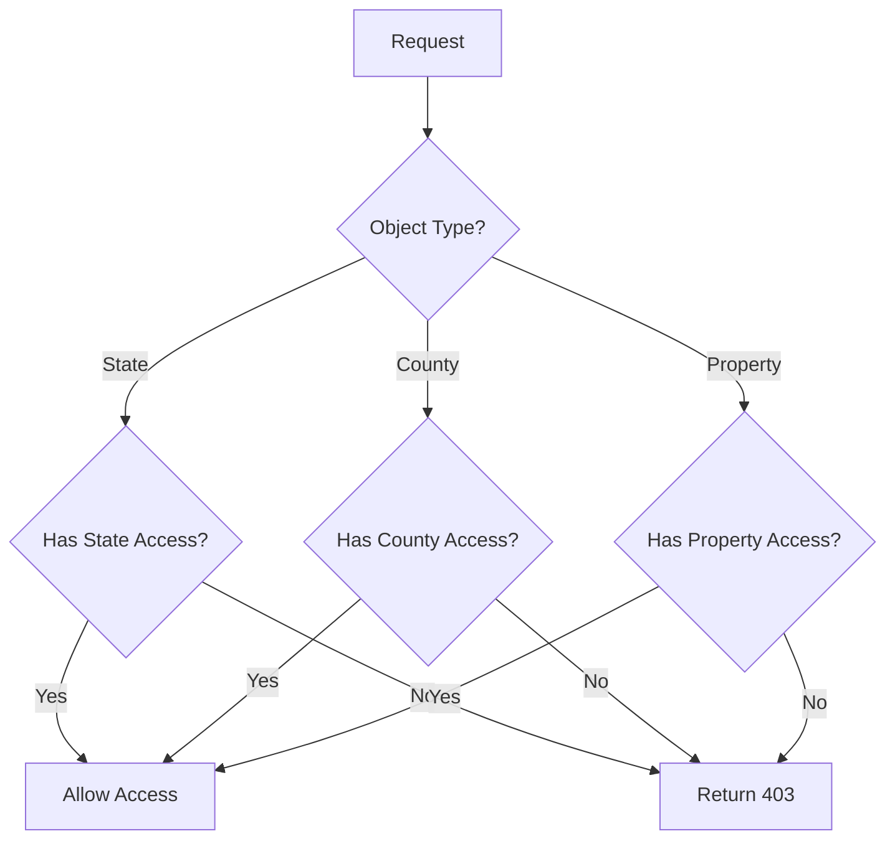
```mermaid
graph TD
    A[Request] --> B{Object Type?}
    B -- State --> C{Has State Access?}
    B -- County --> D{Has County Access?}
    B -- Property --> E{Has Property Access?}
    C -- Yes --> F[Allow Access]
    C -- No --> G[Return 403]
    D -- Yes --> F
    D -- No --> G
    E -- Yes --> F
    E -- No --> G
```

### Error Handling Flow
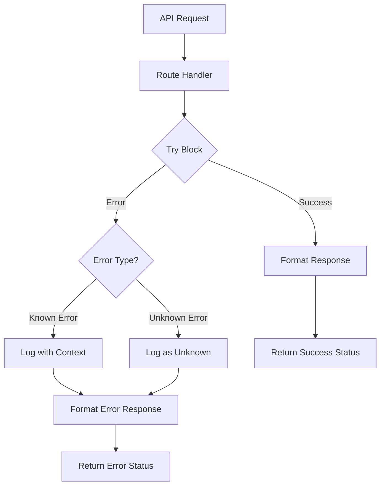
```mermaid
graph TD
    A[API Request] --> B[Route Handler]
    B --> C{Try Block}
    C -- Success --> D[Format Response]
    C -- Error --> E{Error Type?}
    E -- Known Error --> F[Log with Context]
    E -- Unknown Error --> G[Log as Unknown]
    F --> H[Format Error Response]
    G --> H
    H --> I[Return Error Status]
    D --> J[Return Success Status]
```

The error handling system implements consistent patterns across all geographic data routes:
1. All errors are caught and properly typed as `unknown`
2. Errors are checked with `instanceof Error` for proper handling
3. Contextual information is preserved in logs
4. User-facing error messages are sanitized for security
5. Appropriate HTTP status codes are used based on error type

## Test Architecture

The platform implements a comprehensive testing strategy to ensure reliability, maintainability, and quality. The testing architecture is organized into several layers that address different aspects of the system.

### Test Structure
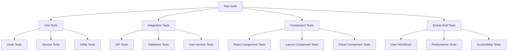
```mermaid
graph TD
    A[Test Suite] --> B[Unit Tests]
    A --> C[Integration Tests]
    A --> D[Component Tests]
    A --> E[End-to-End Tests]
    
    B --> B1[Hook Tests]
    B --> B2[Service Tests]
    B --> B3[Utility Tests]
    
    C --> C1[API Tests]
    C --> C2[Database Tests]
    C --> C3[Inter-service Tests]
    
    D --> D1[React Component Tests]
    D --> D2[Layout Component Tests]
    D --> D3[Panel Component Tests]
    
    E --> E1[User Workflows]
    E --> E2[Performance Tests]
    E --> E3[Accessibility Tests]
```

### Standardized Testing Approach

The platform implements a rigorous standardized testing methodology with the following key features:

1. **Test Case Tracking**: All tests include unique identifiers (e.g., "TC101") that link to the test plan
2. **Flattened Test Structure**: Tests are organized in a flat directory structure with consistent naming conventions
3. **Multiple Enforcement Layers**: Testing standards are enforced through:
   - Pre-commit and pre-push validation hooks
   - Test generators that create properly structured tests
   - Pre-test validation that runs before test execution
   - CI/CD integration for validation during pull requests

For detailed information on the testing methodology:
- [TEST-GUIDE.md](../client/TEST-GUIDE.md) - Quick reference guide for developers
- [TESTING.md](../client/TESTING.md) - Comprehensive testing documentation
- [test-plan.json](../client/test-plan.json) - Complete test case catalog with requirements mapping

### Testing Framework
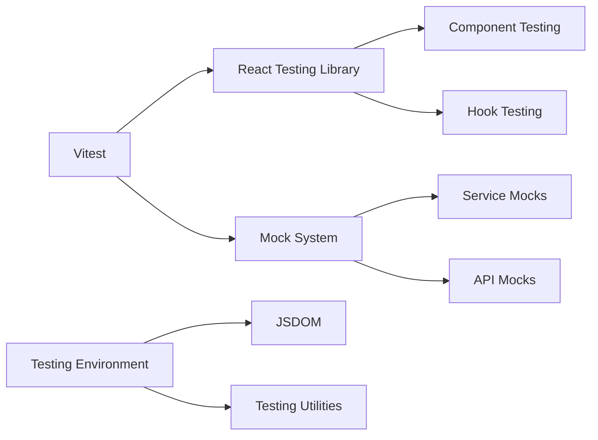
```mermaid
graph LR
    A[Vitest] --> B[React Testing Library]
    A --> C[Mock System]
    
    B --> D[Component Testing]
    B --> E[Hook Testing]
    
    C --> F[Service Mocks]
    C --> G[API Mocks]
    
    H[Testing Environment] --> I[JSDOM]
    H --> J[Testing Utilities]
```

### Test Execution Flow
```mermaid
sequenceDiagram
    participant D as Developer
    participant T as Test Runner
    participant C as Component/Module
    participant M as Mock System
    participant R as Result Reporter
    
    D->>T: Execute Tests
    T->>M: Setup Mocks
    T->>C: Initialize Component
    T->>C: Execute Test Actions
    C->>M: Interact with Mocks
    M-->>C: Return Mock Data
    C-->>T: Return Results
    T->>R: Report Test Results
    R-->>D: Display Test Summary
```

### Test Types and Categories

The test architecture is divided into several test types:

1. **Hook Tests**
   - Tests for custom React hooks
   - Focus on state management and effects
   - Isolation from UI components

2. **Service Tests**
   - Tests for backend services
   - API endpoint validation
   - Data processing logic

3. **Component Tests**
   - UI component validation
   - User interaction simulation
   - Visual consistency checks

4. **Integration Tests**
   - Cross-module communication
   - End-to-end workflows
   - System behavior validation

For detailed information on all test cases, test execution procedures, and quality metrics, refer to the [Comprehensive Test Plan](../client/test-plan.json).

## Deployment Architecture

### CI/CD Pipeline
```mermaid
graph LR
    A[Code Push] --> B[Tests]
    B --> C[Build]
    C --> D[Deploy]
```

This deployment architecture is designed to be simple and efficient, allowing for rapid iterations and continuous delivery of new features. 

# Real Estate Platform Architecture

## Overview

The Real Estate Platform is a comprehensive system designed to manage real estate inventory, including properties, tax liens, and related data. The system is built with a modular architecture centered around a hierarchical data model and various services for data management and export.

## Component Architecture

### Core Components

```
┌─────────────────────────┐       ┌──────────────────────────┐
│                         │       │                          │
│    Client Application   │◄─────►│     API Gateway         │
│                         │       │                          │
└─────────────────────────┘       └──────────┬───────────────┘
                                             │
                                             ▼
┌─────────────────────────────────────────────────────────────────┐
│                                                                 │
│                     Backend Services                            │
│                                                                 │
│  ┌─────────────────┐  ┌─────────────────┐  ┌─────────────────┐  │
│  │                 │  │                 │  │                 │  │
│  │ Authentication  │  │  Inventory      │  │  Export         │  │
│  │    Service      │  │    Service      │  │   Service       │  │
│  │                 │  │                 │  │                 │  │
│  └─────────────────┘  └────────┬────────┘  └────────┬────────┘  │
│                                │                     │           │
│  ┌─────────────────┐  ┌────────▼────────┐  ┌────────▼────────┐  │
│  │                 │  │                 │  │                 │  │
│  │  User           │  │  Data           │  │  File           │  │
│  │   Management    │  │   Processing    │  │   Generation    │  │
│  │                 │  │                 │  │                 │  │
│  └─────────────────┘  └─────────────────┘  └─────────────────┘  │
│                                                                 │
└─────────────────────────────────────────────────────────────────┘
                                │
                                ▼
┌─────────────────────────────────────────────────────────────────┐
│                                                                 │
│                      Database Layer                             │
│                                                                 │
│  ┌─────────────────┐  ┌─────────────────┐  ┌─────────────────┐  │
│  │                 │  │                 │  │                 │  │
│  │   User Data     │  │   Inventory     │  │   Metadata      │  │
│  │                 │  │     Data        │  │                 │  │
│  └─────────────────┘  └─────────────────┘  └─────────────────┘  │
│                                                                 │
└─────────────────────────────────────────────────────────────────┘
```

### Hierarchical Inventory Structure

The inventory system follows a three-tier hierarchical model:

```
┌───────────────────┐
│                   │
│      US Map       │
│                   │
└─────────┬─────────┘
          │
          ▼
┌───────────────────┐
│                   │
│      States       │
│                   │
└─────────┬─────────┘
          │
          ▼
┌───────────────────┐
│                   │
│     Counties      │
│                   │
└─────────┬─────────┘
          │
          ▼
┌───────────────────┐
│                   │
│    Properties     │
│                   │
└───────────────────┘
```

## Data Flow

### Inventory Data Flow

The inventory data follows a hierarchical flow, where each level contains references to its parent and can have multiple children:

1. **US Map** - The top-level container for all geographic data
2. **State** - Belongs to the US Map and contains counties
3. **County** - Belongs to a state and contains properties
4. **Property** - Belongs to a county and can have multiple tax liens

### Export Data Flow

The export functionality provides data extraction capabilities for the inventory hierarchy:

```
┌─────────────────┐     ┌──────────────────┐     ┌───────────────────┐
│                 │     │                  │     │                   │
│ User Interface  │────►│  Export Service  │────►│  Format Service   │
│                 │     │                  │     │                   │
└─────────────────┘     └────────┬─────────┘     └─────────┬─────────┘
                                 │                          │
                                 ▼                          ▼
                        ┌─────────────────┐      ┌───────────────────┐
                        │                 │      │                   │
                        │ Database Query  │      │  File Generation  │
                        │                 │      │                   │
                        └─────────────────┘      └───────────────────┘
```

## Export Service Architecture

The Export Service is responsible for generating formatted data exports from the inventory hierarchy. It supports multiple export formats and filtering capabilities:

```
┌─────────────────────────┐
│                         │
│     Export Service      │
│                         │
└───────────┬─────────────┘
            │
            ▼
┌─────────────────────────────────────────────────────┐
│                                                     │
│                Export Endpoints                     │
│                                                     │
│  ┌─────────────────┐      ┌─────────────────────┐  │
│  │                 │      │                     │  │
│  │ Properties API  │      │    Counties API     │  │
│  │                 │      │                     │  │
│  └────────┬────────┘      └──────────┬──────────┘  │
│           │                           │             │
│           ▼                           ▼             │
│  ┌─────────────────┐      ┌─────────────────────┐  │
│  │                 │      │                     │  │
│  │ CSV Generation  │      │  Excel Generation   │  │
│  │                 │      │                     │  │
│  └─────────────────┘      └─────────────────────┘  │
│                                                     │
└─────────────────────────────────────────────────────┘
```

## Security Architecture

### Access Control

The platform implements object-level permissions based on the hierarchical structure:

1. **Administrator**: Full access to all levels of the hierarchy
2. **State Manager**: Access to assigned states and all child counties and properties
3. **County Manager**: Access to assigned counties and all child properties
4. **Property Manager**: Access to assigned properties only

### Export Permissions

Export functionality respects the hierarchical access control:

- Users can only export data they have access to
- Exports are filtered based on user permissions
- Export activity is logged for audit purposes

## Technology Stack

- **Frontend**: React with Material UI
- **Backend**: Node.js with Express
- **Database**: MongoDB
- **Export Formats**: CSV, Excel
- **API Documentation**: Swagger
- **Authentication**: JWT

## Integration Points

The platform provides integration with external systems through:

1. **API Endpoints**: RESTful APIs for all functionality
2. **Data Export**: CSV and Excel exports for integration with external tools
3. **Import Services**: Data import capabilities from various sources

## Deployment Architecture

The application is containerized using Docker and can be deployed in various configurations:

- **Development**: Local containers with hot reload
- **Testing**: CI/CD pipeline with automated testing
- **Production**: Kubernetes cluster with load balancing and auto-scaling

## Data Architecture

### State Object

```json
{
  "_id": "ObjectId",
  "name": "State Name",
  "abbreviation": "ST",
  "type": "state",
  "parentId": "USMap ObjectId",
  "geometry": {
    "type": "MultiPolygon",
    "coordinates": [...]
  },
  "metadata": {
    "regionalInfo": {
      "region": "Region Name",
      "subregion": "Subregion Name"
    },
    "totalCounties": 0,
    "totalProperties": 0,
    "statistics": {
      "totalTaxLiens": 0,
      "totalValue": 0
    }
  }
}
```

### County Object

```json
{
  "_id": "ObjectId",
  "name": "County Name",
  "type": "county",
  "stateId": "State ObjectId",
  "geometry": {
    "type": "MultiPolygon",
    "coordinates": [...]
  },
  "metadata": {
    "totalProperties": 0,
    "statistics": {
      "totalTaxLiens": 0,
      "totalValue": 0
    },
    "searchConfig": {
      "lookupMethod": "web",
      "searchUrl": "https://example.com/search",
      "lienUrl": "https://example.com/liens"
    }
  }
}
```

### Property Object

```json
{
  "_id": "ObjectId",
  "parcelId": "123456",
  "taxAccountNumber": "TAX-123-456",
  "ownerName": "Property Owner",
  "propertyAddress": "123 Main St",
  "city": "Cityville",
  "stateId": "State ObjectId",
  "countyId": "County ObjectId",
  "zipCode": "12345",
  "location": {
    "coordinates": {
      "latitude": 38.9072,
      "longitude": -77.0369
    },
    "address": {
      "street": "123 Main St",
      "city": "Cityville",
      "state": "ST",
      "county": "County Name",
      "zipCode": "12345"
    }
  },
  "metadata": {
    "propertyType": "Residential",
    "taxStatus": "Current",
    "assessedValue": 250000,
    "marketValue": 300000,
    "taxDue": 3500,
    "saleType": "Tax Sale",
    "saleAmount": 175000,
    "saleDate": "2023-06-15",
    "lastUpdated": "2023-10-01"
  }
}
```

## Collector Framework Architecture

### Collector Component Structure
```mermaid
graph TB
    CF[Collector Framework]
    Config[Configuration Module]
    Runner[Runner Module]
    Monitor[Monitor Module]
    Storage[Storage Module]
    
    CF --> Config
    CF --> Runner
    CF --> Monitor
    CF --> Storage
    
    Config --> Validation[Config Validation]
    Config --> Schema[Schema Definition]
    
    Runner --> Queue[Collection Queue]
    Runner --> Workers[Worker Pool]
    Runner --> Rate[Rate Limiting]
    
    Monitor --> Progress[Progress Tracking]
    Monitor --> Status[Status Updates]
    Monitor --> Metrics[Performance Metrics]
    
    Storage --> Cache[Result Cache]
    Storage --> DB[(MongoDB)]
```

### Collection Flow
```mermaid
sequenceDiagram
    participant C as Client
    participant API as API Module
    participant CF as Collector Framework
    participant DB as MongoDB
    participant Map as Map Component
    
    C->>API: Configure Collection
    API->>CF: Initialize Collection
    CF->>CF: Validate Config
    CF->>DB: Create Collection Job
    CF-->>API: Return Job ID
    API-->>C: Return Status
    
    loop Collection Process
        CF->>CF: Execute Collection
        CF->>DB: Store Results
        CF->>Map: Update Visualization
        CF-->>C: Progress Update
    end
```

### Integration Points

The Collector Framework integrates with other system components:

1. **Inventory Module**
   - Provides data structure for collected properties
   - Manages property relationships and hierarchy
   - Handles property deduplication

2. **Map Component**
   - Real-time visualization of collection progress
   - Geographic filtering of collection targets
   - Status indicators for collected areas

3. **Export Module**
   - Formats collected data for export
   - Provides collection-specific export templates
   - Handles batch export of collection results

## Consolidated Branch Architecture

The platform uses a consolidated branch structure to manage features:

```mermaid
graph TB
    Main[main branch]
    Dev[develop branch]
    Inv[feature/inventory-consolidated]
    Exp[feature/export-consolidated]
    Map[feature/map-consolidated]
    
    Main --> Dev
    Dev --> Inv
    Dev --> Exp
    Dev --> Map
    
    subgraph Inventory
        Inv --> Collector[Collector Framework]
        Inv --> DataModel[Data Models]
        Inv --> API[REST API]
    end
    
    subgraph Export
        Exp --> Templates[Export Templates]
        Exp --> Formats[Format Handlers]
        Exp --> Queue[Export Queue]
    end
    
    subgraph Map
        Map --> Visualization[Map Component]
        Map --> GeoData[GeoJSON Handler]
        Map --> Updates[Real-time Updates]
    end
```

## Data Models

### Core Data Models

The platform uses a set of core data models that implement a consistent approach to data modeling, with particular focus on MongoDB schema design.

#### Geographic Data Hierarchy

```mermaid
graph TD
    USMap[US Map]
    State1[State]
    State2[State]
    County1[County]
    County2[County]
    County3[County]
    Prop1[Property]
    Prop2[Property]
    Prop3[Property]
    Prop4[Property]
    
    USMap --> State1
    USMap --> State2
    State1 --> County1
    State1 --> County2
    State2 --> County3
    County1 --> Prop1
    County1 --> Prop2
    County2 --> Prop3
    County3 --> Prop4
```

#### Consolidated Schema Approach

All geographic entity models (State, County, Property) follow a consolidated schema approach with these consistent patterns:

1. **Proper Reference Types**
   - All MongoDB references use `mongoose.Types.ObjectId` for proper typing
   - References include the correct `ref` parameter for proper population

2. **Nested Statistics Structure**
   - All models use a nested `stats` object to organize metrics and statistical data
   - The `stats` object includes a `lastUpdated` timestamp that is automatically maintained
   - Statistics fields use consistent naming across all models

3. **Middleware for Timestamp Updates**
   - All models implement middleware to update `stats.lastUpdated` when statistics change
   - All models use the `timestamps: true` option for automatic `createdAt`/`updatedAt` fields

4. **Strategic Indexing**
   - Geospatial indexes using `2dsphere` for location-based queries
   - Compound indexes for common query patterns
   - Single-field indexes for frequently searched fields
   - Indexes on common statistical fields for analytics

This consolidated approach ensures data consistency, improves query performance, and simplifies development across the entire platform.

#### Sample Model Structure

```typescript
// County Model Example
interface ICounty extends Document {
  stateId: mongoose.Types.ObjectId;  // Reference to State
  name: string;                      // County name
  // ... other fields ...
  
  stats: {
    medianHomeValue: number;         // Statistical data in nested structure
    medianIncome: number;
    // ... other statistics ...
    lastUpdated: Date;               // Auto-updated timestamp
  };
}
```

### Model Relationships

```mermaid
graph LR
    USMap[USMap] --> State[State]
    State --> County[County]
    County --> Property[Property]
    
    User --> LayoutConfig[Layout Config]
    User --> UserPreferences[User Preferences]
    User --> SavedSearches[Saved Searches]
```

## Testing

### Unit Testing

Unit tests are written using Vitest and React Testing Library. Tests are organized by component and service, with a focus on isolating units of functionality.

```mermaid
graph LR
    A[Unit Tests] --> B[Component Tests]
    A --> C[Service Tests]
    A --> D[Utility Tests]
    A --> E[Hook Tests]
```

### Integration Testing

Integration tests verify that components work together as expected. These tests focus on component interactions, API integrations, and end-to-end flows.

```mermaid
graph LR
    A[Integration Tests] --> B[Component Integration]
    A --> C[API Integration]
    A --> D[Database Integration]
```

### Test Path Structure

All tests follow a standardized path structure to ensure consistency and traceability:

1. **Directory Structure**: All tests are placed in the `src/_tests_/` directory (using single underscores) with a flattened hierarchy
2. **Test ID System**: Each test file is prefixed with a unique Test Case ID (TC ID)
3. **Naming Convention**: `TC{ID}_{component|service|hook}_{name}.test.{js|jsx|ts|tsx}`

#### Example Test Structure

```
src/_tests_/
├── TC101_components_multiframe_controls_LayoutSelector.test.tsx
├── TC201_components_multiframe_MultiFrameContainer.test.tsx
├── TC202_components_multiframe_EnhancedMultiFrameContainer.test.tsx
├── TC301_components_multiframe_PanelContainer.test.tsx
├── TC302_components_multiframe_PanelHeader.test.tsx
├── TC401_components_multiframe_layouts_SinglePanelLayout.test.tsx
├── TC402_components_multiframe_layouts_DualPanelLayout.test.tsx
├── TC403_components_multiframe_layouts_TriPanelLayout.test.tsx
├── TC404_components_multiframe_layouts_QuadPanelLayout.test.tsx
├── TC405_components_multiframe_layouts_AdvancedLayout.test.tsx
├── TC501_services_panelContentRegistry.test.tsx
├── TC601_contexts_MultiFrameContext.test.tsx
└── TC701_utils_panelUtils.test.tsx
```

#### Test Case ID Format

Test IDs follow a numbering system for organization:

- **100-199**: Core controls and UI components
- **200-299**: Container components
- **300-399**: Layout components
- **400-499**: Panel components
- **500-599**: Services
- **600-699**: Context providers
- **700-799**: Utilities and helpers
- **800-899**: Hooks
- **900-999**: Integration tests

#### Test Description Format

Each test includes the TC ID in the test description for traceability:

```typescript
describe('MultiFrameContainer [TC201]', () => {
  it('TC201-1: should render with the specified initial layout', () => {
    // Test implementation
  });
  
  it('TC201-2: should switch layouts when the layout selector is used', () => {
    // Test implementation
  });
});
```

## Continuous Integration

The platform implements a CI/CD pipeline using Docker and Kubernetes for automated testing and deployment. The pipeline includes:

1. **Code Push**: Automated code push to the repository
2. **Tests**: Automated unit and integration tests
3. **Build**: Container image creation
4. **Deploy**: Deployment to Kubernetes cluster

This ensures continuous integration and deployment, allowing for rapid iterations and high-quality releases. 

## API Standards

### Endpoint Naming

API endpoints follow RESTful conventions and use plural nouns to represent resources:

- `/api/states` - List or create states
- `/api/states/:id` - Get, update, or delete a specific state
- `/api/counties` - List or create counties
- `/api/counties/:id` - Get, update, or delete a specific county

### Response Format

API responses follow a consistent format:

```json
{
  "status": "success",
  "data": {},
  "message": ""
}
```

- `status`: "success" or "error"
- `data`: The response data (if applicable)
- `message`: A human-readable message (especially for errors)

### Error Handling

Errors are returned with appropriate HTTP status codes and a consistent format:

```json
{
  "status": "error",
  "message": "Resource not found",
  "code": "NOT_FOUND",
  "details": { ... }
}
```

### Field Naming Standards

All API fields follow clear naming conventions:

1. **Boolean Flags**: Boolean flags are prefixed with `is` or `has` to indicate their purpose clearly:
   - `isDefault`: Indicates whether a layout is the default layout for a user (replacing older `isGlobal` field)
   - `isPublic`: Indicates whether a layout is publicly visible to other users (replacing older `isGlobal` field)
   - `isActive`: Indicates whether a resource is currently active

2. **Field Naming Migration**: When field names change, the API temporarily supports both names during a transition period:
   - Example: Supporting both `isGlobal` (legacy) and `isDefault`/`isPublic` (new) for backward compatibility
   - Proper API versioning should be used for more significant changes

3. **ID References**: ID references to other resources use the format `{resourceType}Id`:
   - `stateId`: Reference to a State
   - `countyId`: Reference to a County
   - `propertyId`: Reference to a Property

### API Versioning

For significant API changes, version numbers should be included in the URL path:

```
/api/v1/layouts
/api/v2/layouts
```

This allows for backward compatibility while introducing new features or breaking changes.

## Security 