# System Architecture

## Overview

The Real Estate Platform follows a modular monolithic architecture with the following key components:

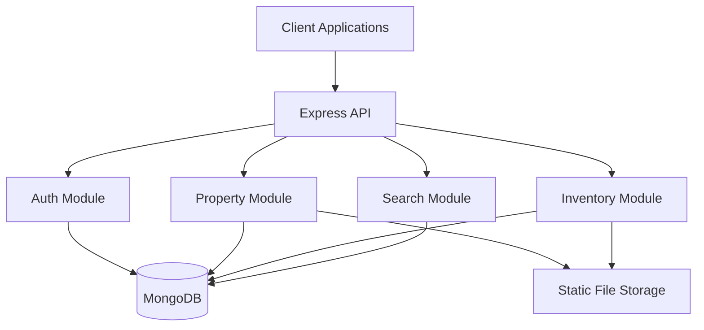
```mermaid
graph TB
    Client[Client Applications]
    API[Express API]
    Auth[Auth Module]
    Prop[Property Module]
    Inventory[Inventory Module]
    Search[Search Module]
    DB[(MongoDB)]
    Static[Static File Storage]

    Client --> API
    API --> Auth
    API --> Prop
    API --> Inventory
    API --> Search
    Auth --> DB
    Prop --> DB
    Inventory --> DB
    Search --> DB
    Prop --> Static
    Inventory --> Static
```

This modular monolithic approach allows for simpler deployment while maintaining separation of concerns through well-defined modules.

## Component Architecture

### Authentication Flow

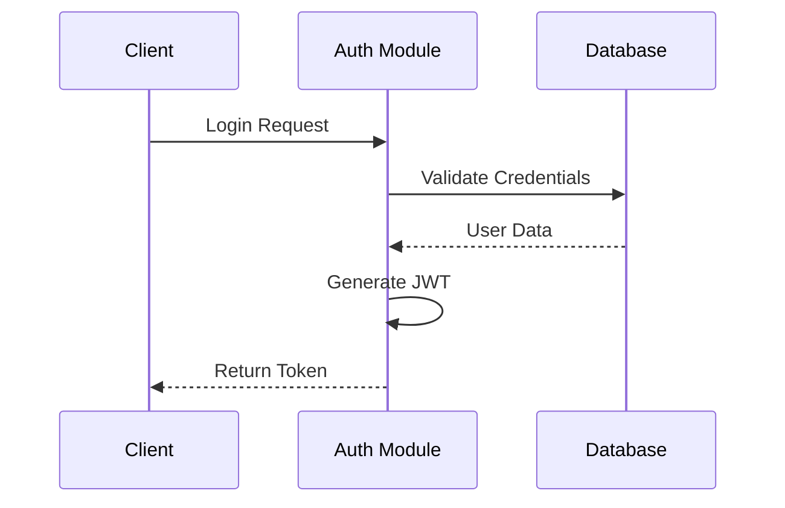
```mermaid
sequenceDiagram
    participant C as Client
    participant A as Auth Module
    participant D as Database
    
    C->>A: Login Request
    A->>D: Validate Credentials
    D-->>A: User Data
    A->>A: Generate JWT
    A-->>C: Return Token
```

### Property Creation Flow

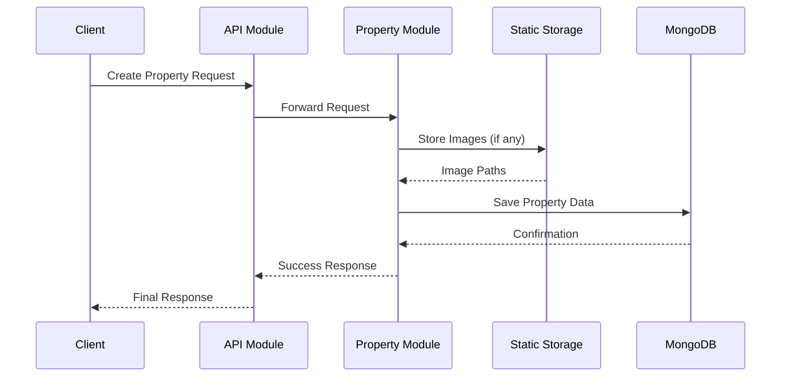
```mermaid
sequenceDiagram
    participant C as Client
    participant API as API Module
    participant P as Property Module
    participant Static as Static Storage
    participant DB as MongoDB

    C->>API: Create Property Request
    API->>P: Forward Request
    P->>Static: Store Images (if any)
    Static-->>P: Image Paths
    P->>DB: Save Property Data
    DB-->>P: Confirmation
    P-->>API: Success Response
    API-->>C: Final Response
```

### Inventory Hierarchical Structure

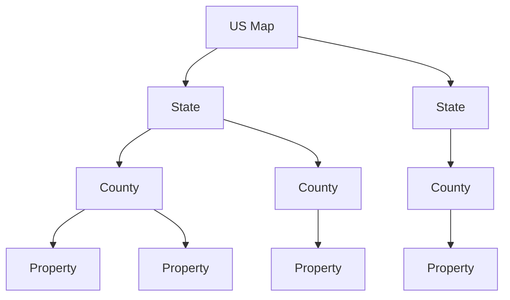
```mermaid
graph TD
    USMap[US Map]
    State1[State]
    State2[State]
    County1[County]
    County2[County]
    County3[County]
    Prop1[Property]
    Prop2[Property]
    Prop3[Property]
    Prop4[Property]
    
    USMap --> State1
    USMap --> State2
    State1 --> County1
    State1 --> County2
    State2 --> County3
    County1 --> Prop1
    County1 --> Prop2
    County2 --> Prop3
    County3 --> Prop4
```

### Search Flow

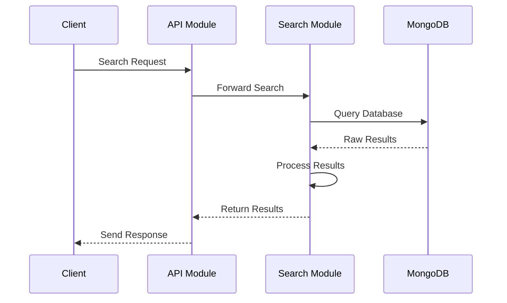
```mermaid
sequenceDiagram
    participant C as Client
    participant API as API Module
    participant S as Search Module
    participant DB as MongoDB

    C->>API: Search Request
    API->>S: Forward Search
    S->>DB: Query Database
    DB-->>S: Raw Results
    S->>S: Process Results
    S-->>API: Return Results
    API-->>C: Send Response
```

## System Components

### API Layer
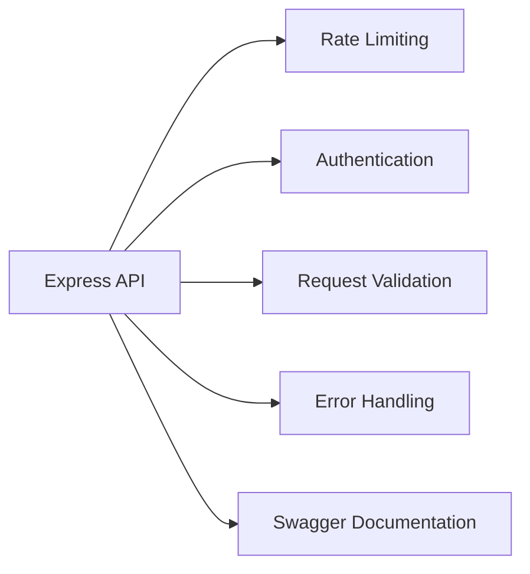
```mermaid
graph LR
    A[Express API] --> B[Rate Limiting]
    A --> C[Authentication]
    A --> D[Request Validation]
    A --> E[Error Handling]
    A --> F[Swagger Documentation]
```

### Property Module
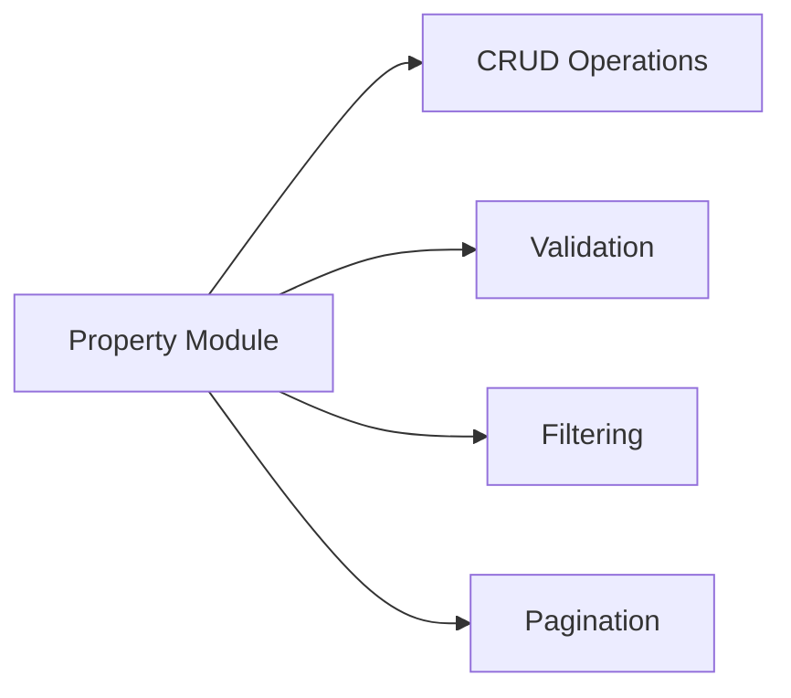
```mermaid
graph LR
    A[Property Module] --> B[CRUD Operations]
    A --> C[Validation]
    A --> D[Filtering]
    A --> E[Pagination]
```

### Inventory Module
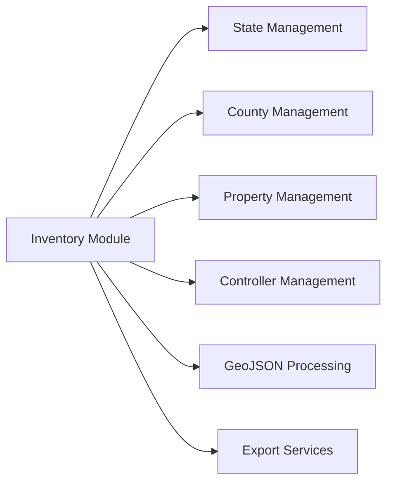
```mermaid
graph LR
    A[Inventory Module] --> B[State Management]
    A --> C[County Management]
    A --> D[Property Management]
    A --> E[Controller Management]
    A --> F[GeoJSON Processing]
    A --> G[Export Services]
```

### Search Module
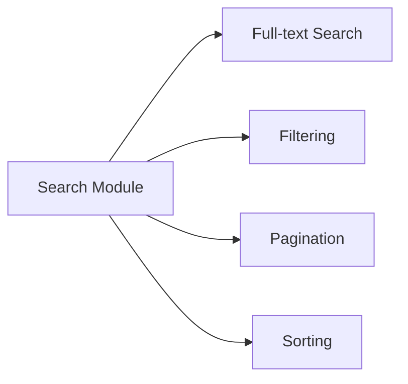
```mermaid
graph LR
    A[Search Module] --> B[Full-text Search]
    A --> C[Filtering]
    A --> D[Pagination]
    A --> E[Sorting]
```

## Data Flow

### User Registration
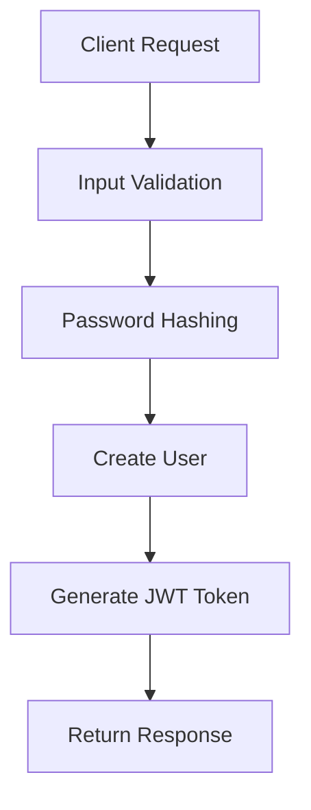
```mermaid
graph TD
    A[Client Request] --> B[Input Validation]
    B --> C[Password Hashing]
    C --> D[Create User]
    D --> E[Generate JWT Token]
    E --> F[Return Response]
```

### Property Listing
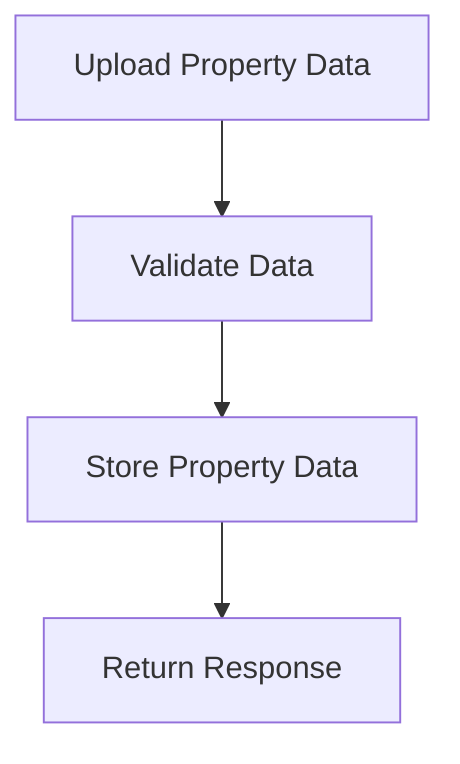
```mermaid
graph TD
    A[Upload Property Data] --> B[Validate Data]
    B --> C[Store Property Data]
    C --> D[Return Response]
```

### State/County/Property Relationship Flow
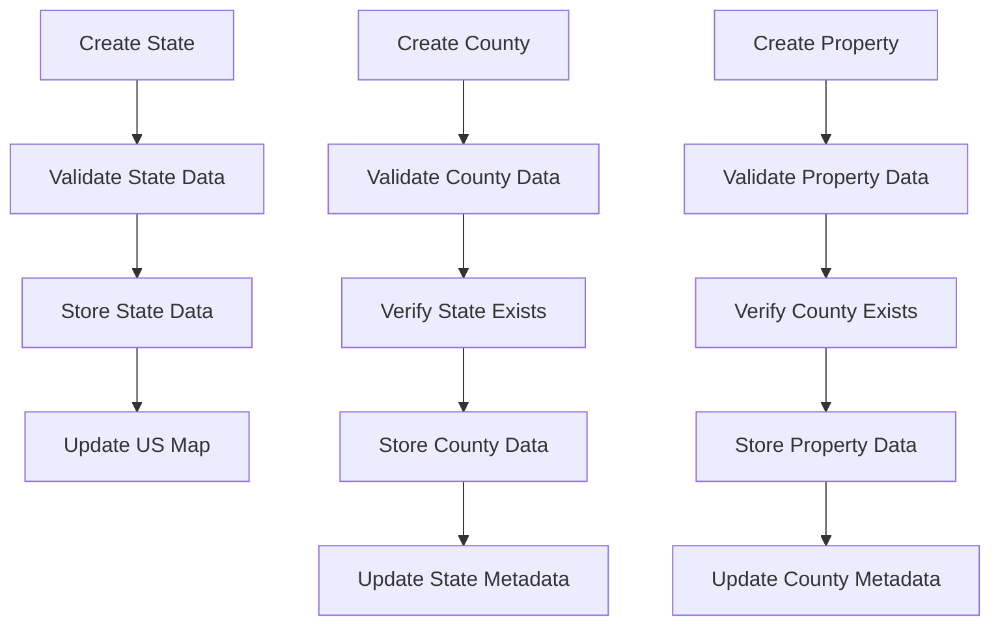
```mermaid
graph TD
    A[Create State] --> B[Validate State Data]
    B --> C[Store State Data]
    C --> D[Update US Map]
    
    E[Create County] --> F[Validate County Data]
    F --> G[Verify State Exists]
    G --> H[Store County Data]
    H --> I[Update State Metadata]
    
    J[Create Property] --> K[Validate Property Data]
    K --> L[Verify County Exists]
    L --> M[Store Property Data]
    M --> N[Update County Metadata]
```

## Infrastructure

### Production Environment
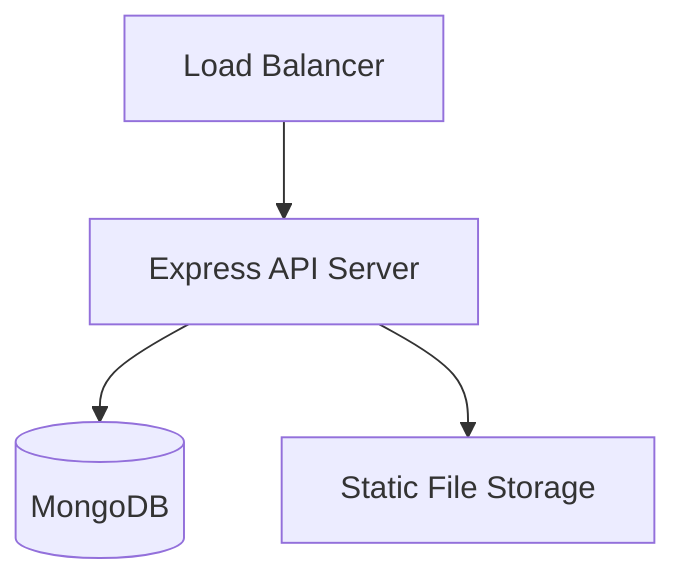
```mermaid
graph TB
    LB[Load Balancer]
    API[Express API Server]
    DB[(MongoDB)]
    Static[Static File Storage]

    LB --> API
    API --> DB
    API --> Static
```

### Monitoring Setup
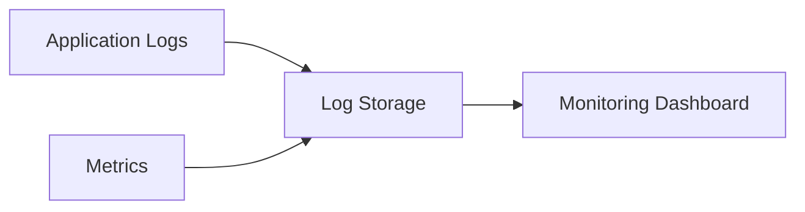
```mermaid
graph LR
    A[Application Logs] --> C[Log Storage]
    M[Metrics] --> C
    C --> G[Monitoring Dashboard]
```

## Security Architecture

### Authentication Flow
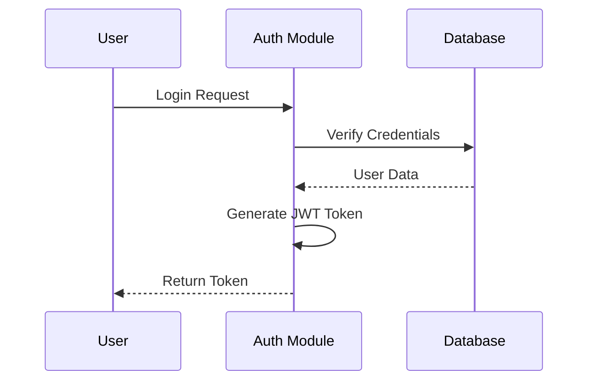
```mermaid
sequenceDiagram
    participant U as User
    participant A as Auth Module
    participant D as Database

    U->>A: Login Request
    A->>D: Verify Credentials
    D-->>A: User Data
    A->>A: Generate JWT Token
    A-->>U: Return Token
```

### Authorization Flow
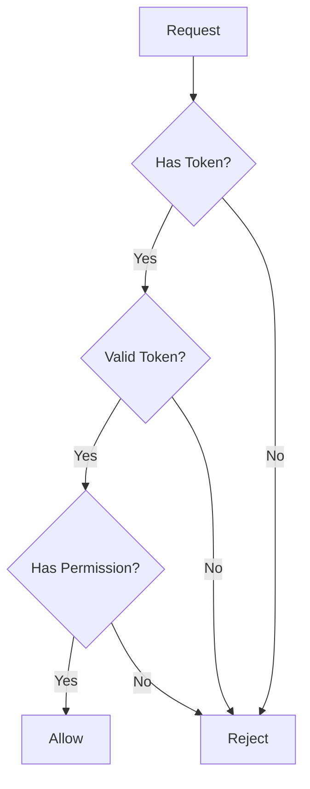
```mermaid
graph TD
    A[Request] --> B{Has Token?}
    B -- Yes --> C{Valid Token?}
    B -- No --> D[Reject]
    C -- Yes --> E{Has Permission?}
    C -- No --> D
    E -- Yes --> F[Allow]
    E -- No --> D
```

### Object-Level Permissions
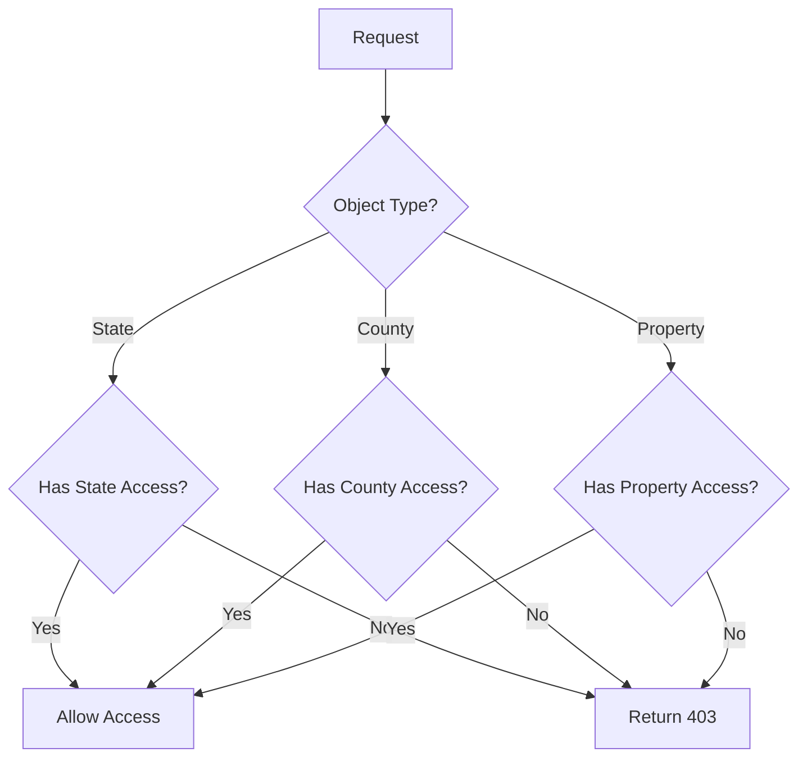
```mermaid
graph TD
    A[Request] --> B{Object Type?}
    B -- State --> C{Has State Access?}
    B -- County --> D{Has County Access?}
    B -- Property --> E{Has Property Access?}
    C -- Yes --> F[Allow Access]
    C -- No --> G[Return 403]
    D -- Yes --> F
    D -- No --> G
    E -- Yes --> F
    E -- No --> G
```

### Error Handling Flow
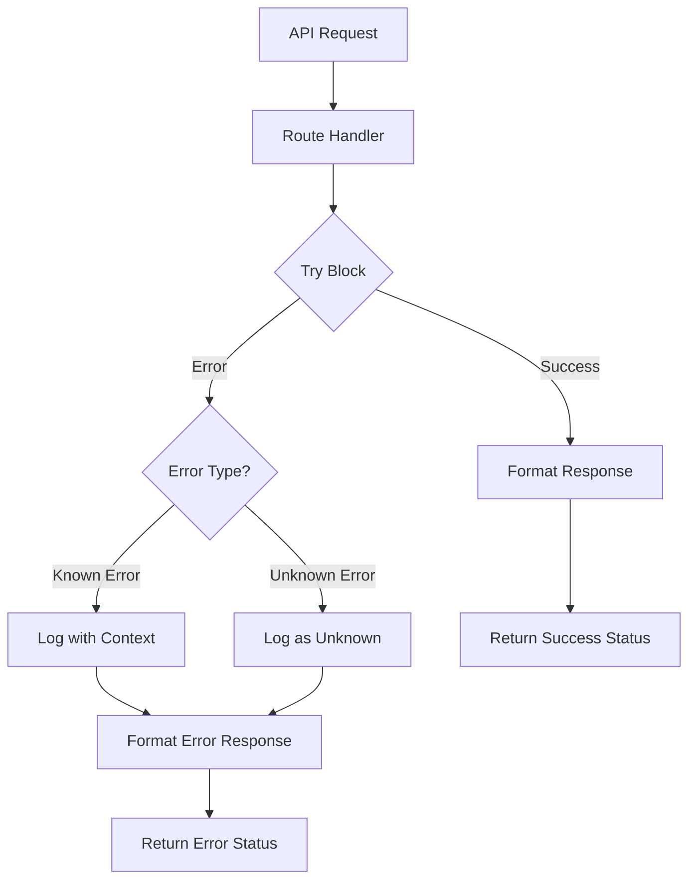
```mermaid
graph TD
    A[API Request] --> B[Route Handler]
    B --> C{Try Block}
    C -- Success --> D[Format Response]
    C -- Error --> E{Error Type?}
    E -- Known Error --> F[Log with Context]
    E -- Unknown Error --> G[Log as Unknown]
    F --> H[Format Error Response]
    G --> H
    H --> I[Return Error Status]
    D --> J[Return Success Status]
```

The error handling system implements consistent patterns across all geographic data routes:
1. All errors are caught and properly typed as `unknown`
2. Errors are checked with `instanceof Error` for proper handling
3. Contextual information is preserved in logs
4. User-facing error messages are sanitized for security
5. Appropriate HTTP status codes are used based on error type

## Deployment Architecture

### CI/CD Pipeline

```mermaid
graph LR
    A[Code Push] --> B[Tests]
    B --> C[Build]
    C --> D[Deploy]
```

This deployment architecture is designed to be simple and efficient, allowing for rapid iterations and continuous delivery of new features. 

# Real Estate Platform Architecture

## Overview

The Real Estate Platform is a comprehensive system designed to manage real estate inventory, including properties, tax liens, and related data. The system is built with a modular architecture centered around a hierarchical data model and various services for data management and export.

## Component Architecture

### Core Components

```
┌─────────────────────────┐       ┌──────────────────────────┐
│                         │       │                          │
│    Client Application   │◄─────►│     API Gateway         │
│                         │       │                          │
└─────────────────────────┘       └──────────┬───────────────┘
                                             │
                                             ▼
┌─────────────────────────────────────────────────────────────────┐
│                                                                 │
│                     Backend Services                            │
│                                                                 │
│  ┌─────────────────┐  ┌─────────────────┐  ┌─────────────────┐  │
│  │                 │  │                 │  │                 │  │
│  │ Authentication  │  │  Inventory      │  │  Export         │  │
│  │    Service      │  │    Service      │  │   Service       │  │
│  │                 │  │                 │  │                 │  │
│  └─────────────────┘  └────────┬────────┘  └────────┬────────┘  │
│                                │                     │           │
│  ┌─────────────────┐  ┌────────▼────────┐  ┌────────▼────────┐  │
│  │                 │  │                 │  │                 │  │
│  │  User           │  │  Data           │  │  File           │  │
│  │   Management    │  │   Processing    │  │   Generation    │  │
│  │                 │  │                 │  │                 │  │
│  └─────────────────┘  └─────────────────┘  └─────────────────┘  │
│                                                                 │
└─────────────────────────────────────────────────────────────────┘
                                │
                                ▼
┌─────────────────────────────────────────────────────────────────┐
│                                                                 │
│                      Database Layer                             │
│                                                                 │
│  ┌─────────────────┐  ┌─────────────────┐  ┌─────────────────┐  │
│  │                 │  │                 │  │                 │  │
│  │   User Data     │  │   Inventory     │  │   Metadata      │  │
│  │                 │  │     Data        │  │                 │  │
│  └─────────────────┘  └─────────────────┘  └─────────────────┘  │
│                                                                 │
└─────────────────────────────────────────────────────────────────┘
```

### Hierarchical Inventory Structure

The inventory system follows a three-tier hierarchical model:

```
┌───────────────────┐
│                   │
│      US Map       │
│                   │
└─────────┬─────────┘
          │
          ▼
┌───────────────────┐
│                   │
│      States       │
│                   │
└─────────┬─────────┘
          │
          ▼
┌───────────────────┐
│                   │
│     Counties      │
│                   │
└─────────┬─────────┘
          │
          ▼
┌───────────────────┐
│                   │
│    Properties     │
│                   │
└───────────────────┘
```

## Data Flow

### Inventory Data Flow

The inventory data follows a hierarchical flow, where each level contains references to its parent and can have multiple children:

1. **US Map** - The top-level container for all geographic data
2. **State** - Belongs to the US Map and contains counties
3. **County** - Belongs to a state and contains properties
4. **Property** - Belongs to a county and can have multiple tax liens

### Export Data Flow

The export functionality provides data extraction capabilities for the inventory hierarchy:

```
┌─────────────────┐     ┌──────────────────┐     ┌───────────────────┐
│                 │     │                  │     │                   │
│ User Interface  │────►│  Export Service  │────►│  Format Service   │
│                 │     │                  │     │                   │
└─────────────────┘     └────────┬─────────┘     └─────────┬─────────┘
                                 │                          │
                                 ▼                          ▼
                        ┌─────────────────┐      ┌───────────────────┐
                        │                 │      │                   │
                        │ Database Query  │      │  File Generation  │
                        │                 │      │                   │
                        └─────────────────┘      └───────────────────┘
```

## Export Service Architecture

The Export Service is responsible for generating formatted data exports from the inventory hierarchy. It supports multiple export formats and filtering capabilities:

```
┌─────────────────────────┐
│                         │
│     Export Service      │
│                         │
└───────────┬─────────────┘
            │
            ▼
┌─────────────────────────────────────────────────────┐
│                                                     │
│                Export Endpoints                     │
│                                                     │
│  ┌─────────────────┐      ┌─────────────────────┐  │
│  │                 │      │                     │  │
│  │ Properties API  │      │    Counties API     │  │
│  │                 │      │                     │  │
│  └────────┬────────┘      └──────────┬──────────┘  │
│           │                           │             │
│           ▼                           ▼             │
│  ┌─────────────────┐      ┌─────────────────────┐  │
│  │                 │      │                     │  │
│  │ CSV Generation  │      │  Excel Generation   │  │
│  │                 │      │                     │  │
│  └─────────────────┘      └─────────────────────┘  │
│                                                     │
└─────────────────────────────────────────────────────┘
```

## Security Architecture

### Access Control

The platform implements object-level permissions based on the hierarchical structure:

1. **Administrator**: Full access to all levels of the hierarchy
2. **State Manager**: Access to assigned states and all child counties and properties
3. **County Manager**: Access to assigned counties and all child properties
4. **Property Manager**: Access to assigned properties only

### Export Permissions

Export functionality respects the hierarchical access control:

- Users can only export data they have access to
- Exports are filtered based on user permissions
- Export activity is logged for audit purposes

## Technology Stack

- **Frontend**: React with Material UI
- **Backend**: Node.js with Express
- **Database**: MongoDB
- **Export Formats**: CSV, Excel
- **API Documentation**: Swagger
- **Authentication**: JWT

## Integration Points

The platform provides integration with external systems through:

1. **API Endpoints**: RESTful APIs for all functionality
2. **Data Export**: CSV and Excel exports for integration with external tools
3. **Import Services**: Data import capabilities from various sources

## Deployment Architecture

The application is containerized using Docker and can be deployed in various configurations:

- **Development**: Local containers with hot reload
- **Testing**: CI/CD pipeline with automated testing
- **Production**: Kubernetes cluster with load balancing and auto-scaling

## Data Architecture

### State Object

```json
{
  "_id": "ObjectId",
  "name": "State Name",
  "abbreviation": "ST",
  "type": "state",
  "parentId": "USMap ObjectId",
  "geometry": {
    "type": "MultiPolygon",
    "coordinates": [...]
  },
  "metadata": {
    "regionalInfo": {
      "region": "Region Name",
      "subregion": "Subregion Name"
    },
    "totalCounties": 0,
    "totalProperties": 0,
    "statistics": {
      "totalTaxLiens": 0,
      "totalValue": 0
    }
  }
}
```

### County Object

```json
{
  "_id": "ObjectId",
  "name": "County Name",
  "type": "county",
  "stateId": "State ObjectId",
  "geometry": {
    "type": "MultiPolygon",
    "coordinates": [...]
  },
  "metadata": {
    "totalProperties": 0,
    "statistics": {
      "totalTaxLiens": 0,
      "totalValue": 0
    },
    "searchConfig": {
      "lookupMethod": "web",
      "searchUrl": "https://example.com/search",
      "lienUrl": "https://example.com/liens"
    }
  }
}
```

### Property Object

```json
{
  "_id": "ObjectId",
  "parcelId": "123456",
  "taxAccountNumber": "TAX-123-456",
  "ownerName": "Property Owner",
  "propertyAddress": "123 Main St",
  "city": "Cityville",
  "stateId": "State ObjectId",
  "countyId": "County ObjectId",
  "zipCode": "12345",
  "location": {
    "coordinates": {
      "latitude": 38.9072,
      "longitude": -77.0369
    },
    "address": {
      "street": "123 Main St",
      "city": "Cityville",
      "state": "ST",
      "county": "County Name",
      "zipCode": "12345"
    }
  },
  "metadata": {
    "propertyType": "Residential",
    "taxStatus": "Current",
    "assessedValue": 250000,
    "marketValue": 300000,
    "taxDue": 3500,
    "saleType": "Tax Sale",
    "saleAmount": 175000,
    "saleDate": "2023-06-15",
    "lastUpdated": "2023-10-01"
  }
}
``` 