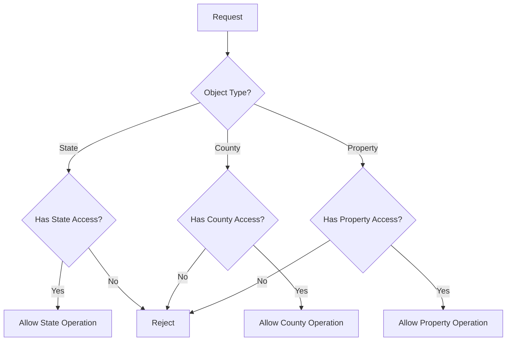

# System Architecture

## Overview

The Real Estate Platform follows a modular monolithic architecture with the following key components:

This modular monolithic approach allows for simpler deployment while maintaining separation of concerns through well-defined modules.

## Component Architecture

### Authentication Flow

### Property Creation Flow

### Inventory Hierarchical Structure

### Search Flow

## System Components

### API Layer

### Property Module

### Inventory Module

### Search Module

## Data Flow

### User Registration

### Property Listing

### State/County/Property Relationship Flow

## Infrastructure

### Production Environment

### Monitoring Setup

## Security Architecture

### Authentication Flow

### Authorization Flow

### Object-Level Permissions

## Deployment Architecture

### CI/CD Pipeline

This deployment architecture is designed to be simple and efficient, allowing for rapid iterations and continuous delivery of new features. 