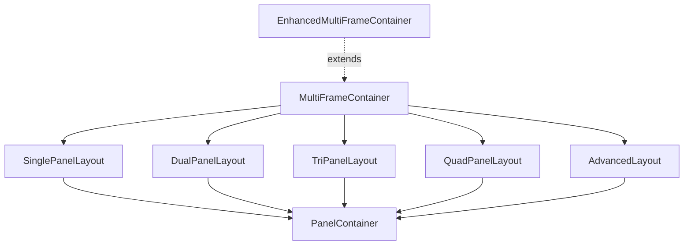

# Component Architecture

## Overview

This document outlines the component architecture of the Real Estate Platform, with specific focus on the multiframe layout system and component relationships.

## Core Component Types

The application uses several types of components:

1. **Container Components**: Manage state and business logic
2. **Presentation Components**: Focus on UI rendering with minimal logic
3. **Layout Components**: Manage the arrangement and positioning of elements
4. **Higher-Order Components (HOCs)**: Add functionality to existing components
5. **Composite Components**: Combine multiple components into reusable units

## Multiframe System

### Purpose

The multiframe system provides a flexible, configurable layout system that allows users to view and interact with multiple data panels simultaneously. This is particularly useful for real estate data visualization where users need to compare property details, maps, statistics, and other information.

### Architecture

The multiframe system is built using a hierarchical component structure:

```
MultiFrameContainer
├── LayoutSelector
└── [Layout Component]
    ├── PanelContainer
    │   ├── PanelHeader
    │   └── [Panel Content]
    ├── PanelContainer
    │   ├── PanelHeader
    │   └── [Panel Content]
    └── ...
```

#### Key Components

1. **MultiFrameContainer**
   - Root component managing the overall state and layout selection
   - Handles panel configuration and layout changes
   - Passes configuration to child components

2. **EnhancedMultiFrameContainer**
   - Extends MultiFrameContainer with additional features
   - Adds layout saving/loading functionality
   - Provides additional UI controls

3. **LayoutSelector**
   - UI component for selecting different layout types
   - Communicates with parent container to update layouts

4. **Layout Components**
   - **SinglePanelLayout**: Full-width single panel
   - **DualPanelLayout**: Two panels side by side
   - **TriPanelLayout**: Three panels in configurable arrangements
   - **QuadPanelLayout**: Four panels in a grid
   - **AdvancedLayout**: Custom, user-configurable layout with draggable panels

5. **PanelContainer**
   - Wrapper for panel content with standardized header, resize, and close controls
   - Manages individual panel state

### State Management

The multiframe system uses a combination of React's Context API and component-level state:

1. **Layout State**: Managed by MultiFrameContainer, this includes:
   - Current layout type
   - Panel configurations
   - Layout change callbacks

2. **Panel State**: Each panel maintains its own state including:
   - Content type
   - Visibility
   - Size and position
   - Instance-specific data

### Data Flow

1. User selects a layout via the LayoutSelector
2. MultiFrameContainer receives the selection and updates its state
3. MultiFrameContainer renders the appropriate layout component
4. The layout component arranges the panels based on configuration
5. Each panel renders its specific content

### Component Props Interface

#### MultiFrameContainer

```typescript
interface MultiFrameContainerProps {
  initialLayout: LayoutType;
  panels?: PanelConfig[];
  defaultPanelContent?: Record<string, string>;
  onLayoutChange?: (layout: LayoutConfig) => void;
  className?: string;
  enableAdvancedLayout?: boolean;
  _isTestingMode?: boolean; // Testing only
}
```

#### Layout Components

```typescript
interface LayoutProps {
  panels: PanelConfig[];
}
```

#### PanelContainer

```typescript
interface PanelProps {
  id: string;
  title: string;
  contentType: PanelContentType;
  position: PanelPosition;
  size: PanelSize;
  onResize?: (id: string, size: PanelSize) => void;
  onClose?: (id: string) => void;
  onMaximize?: (id: string) => void;
}
```

## Component Inheritance and Composition

The MultiFrame system follows a specific inheritance and composition pattern:

### Component Hierarchy

1. **Base Components:**
   - `MultiFrameContainer`: Root container component
   - `PanelContainer`: Base panel wrapper

2. **Specialized Components:**
   - `EnhancedMultiFrameContainer`: Extends functionality of MultiFrameContainer
   - Layout components (SinglePanelLayout, DualPanelLayout, etc.): Composed by MultiFrameContainer

3. **Composition Relationships:**
   - MultiFrameContainer → Layout Components → PanelContainer → Panel Content
   - Each level has clear responsibilities and interfaces

### Responsibility Distribution

- **MultiFrameContainer**: Layout type management, panel configuration
- **EnhancedMultiFrameContainer**: Extends MultiFrameContainer with additional features for advanced layouts
- **Layout Components**: Panel arrangement and positioning
- **PanelContainer**: Individual panel rendering, state management
- **Panel Content**: Domain-specific functionality

### Inheritance Example



## Testing Considerations

The multiframe system requires special testing approaches:

1. **Component Isolation**: Each component should be tested in isolation with mocks for dependencies
2. **State Management Testing**: Verify state updates trigger correct re-renders
3. **Layout Switching**: Test smooth transitions between different layouts
4. **Advanced Layout Testing**: Verify drag-and-drop and resizing functionality
5. **Panel Content Loading**: Test that panels load appropriate content based on configuration

### Special Testing Considerations for MultiFrameContainer

When testing the MultiFrameContainer, be aware of potential infinite re-render issues. See the [Testing Guide with Multiframe Instructions](../../src/__tests__/README.md) for detailed information.

## Related Documentation

- [Panel Communication](./panel-communication.md)
- [Testing Guide](../testing.md)
- [Testing Guide with Multiframe Instructions](../../src/__tests__/README.md) 